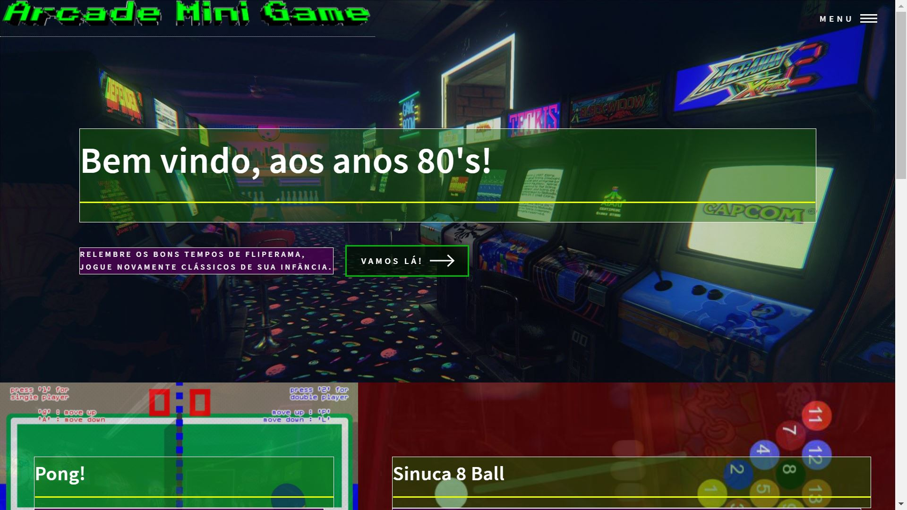

# arcademinigame
Mini games de clássicos dos anos 80/90 feito em JavaScript

Saudações a todos!
É com muito orgulho que apresento meu mais novo projeto.
Antes de falar sobre ele quero ressaltar alguns fatos.
Eu comecei a focar meus estudos em programação no meio de Agosto de 2021.
Minha maior motivação sempre foi vencer a mim mesmo, provar pra mim que sou capaz.
Eis me aqui, lutando diariamente contra todos obstáculos e procrastinações que é natural de nossa essência humana.
Esse foi o projeto mais desafiador e mais complexo que elaborei até hoje, apliquei todos conceitos, principalmente os que aprendi no Bootcamp da @DigitalInnovationOne.
Quero ressaltar também, que o resultado alcançado também se deve a mentoria do @PedroMarins, ele sempre ressalta “Constância constrói caráter”.
 
#PraCegoVer: O texto abaixo, descreverá o projeto.

SOBRE O PROJETO.
(Tentarei ser o mais didático possível para técnicos e leigos entenderem.)

Se trata de um site com mini jogos que marcaram época, principalmente nos anos 80/90’s.
O site traz uma temática totalmente colorida, cores no estilo neon, pra justamente remeter aqueles fliperamas de antigamente com suas cores e luzes.
No logo busquei usar a fonte do minecraft, sempre achei com visual retrô.
As caixas de texto busquei colocar um efeito transparente esverdeado pra remeter a um vidro.
Há um background fixo com a imagem de um fliperama com bastante luzes e cores.
Os botões tem uma animação (hover) no estilo vaporwave.
O site conta com três mini games: Pong!, Sinuca e Snake. Ao abrir haverá instruções como jogar.
Ao deslizar o mouse sobre a caixa do jogo, você verá outra animação (hover), alterando o print do jogo, para uma imagem ilustrativa.
Descendo um pouco mais, adicionei uma caixa explicando quem sou e com botão para meu portfólio. Além de um fundo do jogo Tétris.
Ao descer, o background terá um efeito de transição parallax, inspirado no meu outro projeto “sci-fi parallax”.
A ideia é passar a sensação de que o usuário está fazendo um passeio em um fliperama, ou melhor, um passeio dentro de suas mais nostálgicas lembranças.
Finalmente, ao rolar para o fim da página, haverá campos com meus contatos e redes sociais.
Foi utilizado linguagem HTML, CSS, SCSS e JavaScript. Além das bibliotecas e frameworks como, jQuery, SASS e p5.JS. O site é melhor visualizado em um computador. Não é possível jogar em um dispositivo móvel. Esse meu projeto foi praticamente SOLO, ou seja, sem vídeo aulas, apenas juntando meus conhecimentos prévios. Espero que gostem. Sua reação e comentário me motivará a continuar compartilhando meu progresso.
Atenciosamente,

Link do site: https://arcademinigame.netlify.app/
